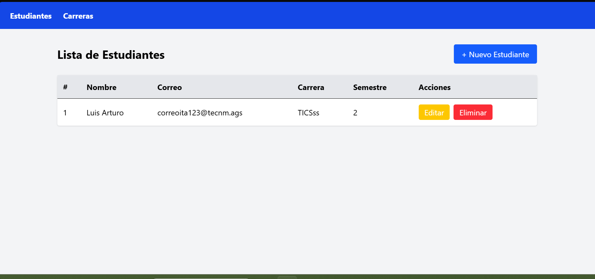

**Nombre:** Luis Arturo Cruz Coria
**ID:** 23151197
**Materia:** Programación Web

## Tecnologías utilizadas:
- PHP 8.3 (si se llega a utilizar PHP 8.5, es posible que no funcione correctamente por cuestiones de inestabilidad con la versión más reciente)
- Laravel 12
- Tailwind CSS
- SQL Server (Windows Authentication)
- Laragon

## Funcionalidades

- Registrar, editar y eliminar carreras
- Registrar, editar y eliminar estudiantes
- Relación entre estudiantes y carreras
- Validación de formularios
- Mensajes de éxito y error

El CRUD presentado en este proyecto nos permite guardar información de carreras disponibles en una universidad, también nos permite guardar información de los alumnos que estudian en dicha universidad. Además de solamente guardar información, se puede modificar y eliminar en caso de ser necesario. (Como nota, siempre hay que asegurar que haya por lo menos 1 carrera agregada antes de intentar agregar algún alumno)

## Repositorio

https://github.com/arturocruz-0503/CRUD_Estudiantes 

# Vista Previa

